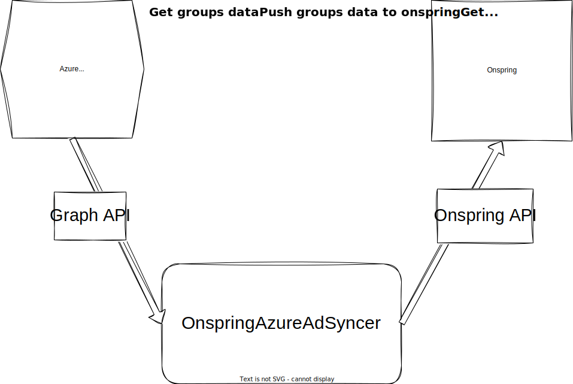

# Overview

## Background

Many onspring customers who utilize the Onspring platform choose to leverage Onspring's existing SSO integration for authentication. This integration allows customers to setup a single sign-on experience for their users using their existing identity management provider. As part of this existing integration Onspring supports accepting claims for the user's username, email address, first name, last name, and optionally groups. It also allows for just-in-time provisioning of users and groups if they are not already present in Onspring. This integration also updates the user's username, email address, first name, last name, and groups in Onspring upon each login if they change in the identity management provider between logins. Many customers utilize this integration with Azure Active Directory (AAD) as their identity management provider

## Problem Statement

However the existing SSO integration doesn't allow customers to centrally manage their users and groups in Onspring through Azure Active Directory and keep the two systems in sync using Azure Active Directory as the system of record. Nor allow them to leverage any existing access models built in Azure Active Directory to also manage access in Onspring.

## Solution

Build a .NET console application that can be run on a schedule or as a scheduled task that will synchronize users and groups between Azure Active Directory and Onspring making Azure Active Directory the system of record.

## Requirements

- Keep groups, users, and group membership in sync between Azure Active Directory and Onspring using Azure Active Directory as the system of record.
  - if a user is created in Azure Active Directory, create the user in Onspring with the status _**Inactive**_
  - if a user is deleted in Azure Active Directory, set the user's status to _**Inactive**_ in Onspring
  - if a user is disabled in Azure Active Directory, set the user's status to _**Inactive**_ in Onspring
  - if a user is added to a group in Azure Active Directory, add the user to the group in Onspring
  - if a user is removed from a group in Azure Active Directory, remove the user from the group in Onspring
  - if a group is created in Azure Active Directory, create the group in Onspring
  - if a user is added to specific group(s) in Azure Active Directory, add the user in Onspring as an _**Active**_ user if they are not already present in Onspring or _**enable**_ the user in Onspring if they are already present in Onspring
  - if a user is removed from specific group(s) in Azure Active Directory, disable the user in Onspring.
- Synchronize all users and groups in Azure Active Directory with Onspring.
- Allow for configuration of the application to specify OnspringActive groups which identify users that should be Active in Onspring.
  - By default synchronize all users in Azure Active Directory as _**Inactive**_ in Onspring.
  - By default synchronize all users in Azure Active Directory that are in one of the OnspringActive groups as _**Active**_ in Onspring.
- Allow for configuration of the application to specify what properties of the user should be synchronized with Onspring and into what field in Onspring.
  - By default synchronize the user's
    - Username
    - Email Address
    - First Name
    - Last Name
    - Groups
    - Status...
      - as _**Inactive**_ if the user is not in Azure Active Directory
      - as _**Inactive**_ if the user is in Azure Active Directory but does not belong to any of the specified OnspringActive groups
      - as _**Active**_ if the user belongs to is in Azure Active Directory and belongs to one of the specified OnspringActive groups
- Allow for configuration of the application to specify what properties of the group should be synchronized with Onspring and into what field in Onspring.
  - By default synchronize the group name.
- Require the application to be configure with an Onspring API Key with proper permissions
- Require the application to be configured with an Azure Active Directory Application client id and client secret and possibly a tenant id.
- Will provide a log output of the synchronization process.

## Interface

The application will be a .NET console application that can be run on a schedule or as a scheduled task. The application will be configured using a configuration file that will be passed in as a command line argument. The configuration file will be a JSON file that will contain the following properties:

- Onspring API Key
- Azure Active Directory Application Client Id
- Azure Active Directory Application Client Secret
- Azure Active Directory Tenant Id
  - Only required if the application is registered in Azure Active Directory to only support accessing
- OnspringActive Groups
  - An array of group names that identify groups that should be used to identify users that should be Active in Onspring.
- User Properties
  - An array of objects that define the properties of the user that should be synchronized with Onspring and into what field in Onspring.
    - Property Name
    - Onspring Field Id
- Group Properties
  - An array of objects that define the properties of the group that should be synchronized with Onspring and into what field in Onspring.
    - Property Name
    - Onspring Field Id

## Limitations

- The application will not support deleting users or groups in Onspring.
  - If a user is deleted in Azure Active Directory, the user will be set to _**Inactive**_ in Onspring and be removed from all groups.
  - If a group is deleted in Azure Active Directory, the group will remain in Onspring, but all users will be removed from the group.
- The application will only support synchronizing users and groups in Azure Active Directory that are in the same Azure Active Directory tenant as the application client id and client secret provided.
- The application will only support synchronizing users and groups in Onspring that are in the same Onspring instance as the Onspring API Key provided.
- The application will only support synchronizing users and groups between one Onspring instance and one Azure Active Directory tenant.
